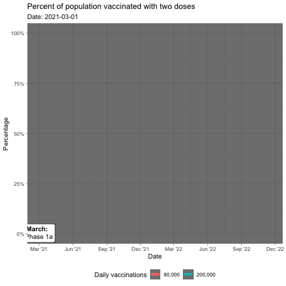

# Vaccinating Australia: How long will it take?

## Abstract
The Australian Government's COVID-19 vaccine rollout strategy is scheduled to commence in late February 2021 and aims to vaccinate the Australian adult population by the end of October 2021. The task of vaccinating some 20 million people within this timeframe presents considerable logistical challenges. Key to meeting this target is the rate of vaccine delivery: the number of vaccine doses that can be administered per day. In the opening phase, high priority groups will receive the Pfizer/BioNTech vaccine through hospital hubs at an initial rate of 80,000 doses per week. However, pending regulatory approval, the currently announced plan appears to be to distribute the AstraZeneca vaccine to the bulk of the popluation through a combination of general practices and community pharmacies. Here, we run a series of projections to estimate how long it will take to vaccinate the Australian population under different assumptions about the rate of vaccine administration as well as the schedule for second doses and prevalence of vaccine hesitancy. Our analysis highlights the ambitious rate of vaccine administration that will be neccessary to meet the Australian Government completion target of October 2021. A rate of 200,000 doses per day would comfortably meet that target; 80,000 doses a day would see roll-out extended until mid-2022. Speed is of the essence when it comes to vaccine rollout: protecting the population quickly will minimise the risk of sporadic and costly lockdowns lockdowns and the potential for small, local clusters getting out of control and sparking new epidemic waves. The government should gather all its resources to maximise the daily vaccination rate, ideally aiming to ramp up administration to at least 200,000 doses per day as quickly as possible. Quickly achieving and maintaining this pace will likely require dedicated large-scale vaccination sites that are capable of delivering thousands of doses a week in addition to the enthusiastic participation of GP practices and community pharmacies around the country. Lessons on the neccessary logistical planning, including coordination of delivery, ultra-cold-chain storage and staffing, can potentially be learned from Israel, where between 7,000 and 20,000 vaccinations per million population have been delivered daily throughout January. 

## Links
* View and download the latest version of the paper from [medRxiv](https://doi.org/10.1101/2021.02.02.21250979)
* Download the paper from [GitHub](https://github.com/CBDRH/vaccinatingAustralia/raw/main/researchNote/researchNote.pdf) 
* Article in [The Conversation](https://theconversation.com/australia-must-vaccinate-200-000-adults-a-day-to-meet-october-target-new-modelling-154476) 
* Public data on the rate of daily vaccinations from [ourworldindata.org](https://github.com/owid/covid-19-data/tree/master/public/data/vaccinations)

## Suggested citation
Vaccinating Australia: How long will it take? Mark Hanly, Timothy Churches, Oisin Fitzgerald, C Raina MacIntyre and Louisa Jorm. medRxiv 2021.02.02.21250979; doi: https://doi.org/10.1101/2021.02.02.21250979

***

